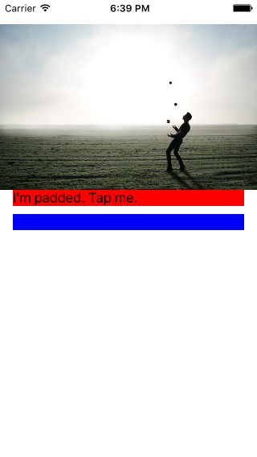
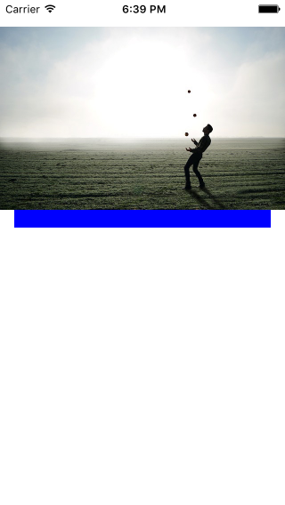

`PaddedView` is a `UIView` subclass that sets its `layoutMargins` to `UIEdgeInsetsZero` if its content's height or width is zero.

This makes it easy to create views that need to show padding, but which need the padding to disappear when their content is nil. 

## Usage

```swift
import UIKit
import PaddedView

class ViewController: UIViewController {

    let redLabel = UILabel()

    override func viewDidLoad() {
        super.viewDidLoad()

        //setup your view:
        redLabel.text = "I'm padded."
        redLabel.backgroundColor = UIColor.redColor()

        //Add it as the content of a PaddedView, include the padding:
        let redLabelPadded = PaddedView(content: redLabel, bottomPadding: 20)

        //add the padded view to the superview:
        view.addSubview(redLabelPadded)


        let blueView = UIView()
        blueView.backgroundColor = UIColor.blueColor()
        blueView.translatesAutoresizingMaskIntoConstraints = false
        view.addSubview(blueView)


        //Set up your other constraints:
        let constraints = [
            "H:|-[redLabelPadded]-|",
            "H:|-[blueView]-|",

            //the bottom anchor of redLabelPadded
            //is equal to the top anchor of blueView.
            //The padding will be visible only when 
            //the content of redLabel is not nil.
            "V:|-30-[redLabelPadded][blueView(20)]"

            ].flatMap {
                NSLayoutConstraint.constraintsWithVisualFormat(
                    $0,
                    options: [],
                    metrics: nil,
                    views: ["redLabelPadded": redLabelPadded, "blueView": blueView]
                )
        }
        
        NSLayoutConstraint.activateConstraints(constraints)

        view.addGestureRecognizer(UITapGestureRecognizer(target: self, action: #selector(tapped)))
    }

    //When you set the content of the paddedview to nil, its size will
    //become zero, and its padding will disappear:
    func tapped() {
        redLabel.text = redLabel.text == nil ? "Tap somewhere" : nil
    }
}

```

## Demo





